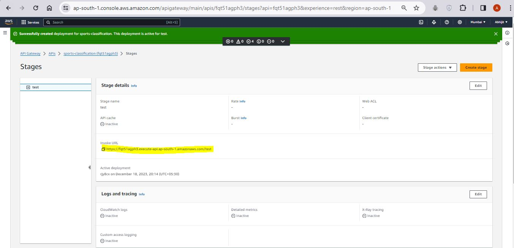
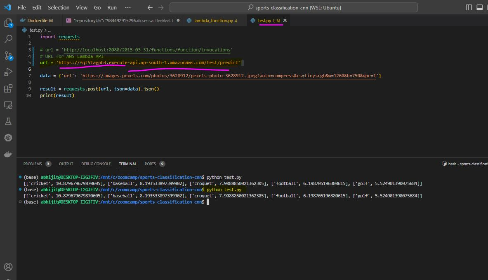

# SPORTS IMAGE CLASSIFICATION USING TENSORFLOW

## CONTENTS

- [PROJECT OVERVIEW](#project-overview)
- [ABOUT THE DATASET](#about-the-dataset)
- [PRE-REQUISITES](#pre-requisites)
- [HOW TO USE](#how-to-use)
 - [CREATE VIRTUAL ENVIORNMENT](#create-virtual-environment)
 - [TEST NOTEBOOKS](#test-notebooks)
 - [TRAIN SCRIPT](#train)
 - [MAKE PREDICTIONS](#make-predictions)
  - [With Docker](#docker)
- [CLOUD SERVING](#cloud-serving)
- [CONCLUSION](#conclusion)
- [NEXT STEPS](#next-steps)
- [CONTRIBUTORS](#contributors)
- [ACKNOWLEDGEMENTS](#acknowledgements)
- [CONTRIBUTIONS](#contributions)

## [PROJECT OVERVIEW](#project-overview)

This repository is a project dedicated to classifying various sports images to their respective sports using __`Convolutional Neural Networks`__.

We use __`Transfer Learning`__ to utilise prebuilt models on __`imagenet`__ dataset and try to improve on their performance using fine-tuning techniques.

## [ABOUT THE DATASET](#about-the-dataset)

The dataset used for the project, contains images from 100 different kinds of sports and is already split into train, valid and test sets to make life a bit easier. The dataset has been copied from a __`kaggle`__ source.

Link to the dataset: (https://www.kaggle.com/datasets/gpiosenka/sports-classification?select=sports.csv)

Contains: 13493 train, 500 test, 500 validate images.

## [PRE-REQUISITES](#pre-requisites)

```
git
linux / WSL2
miniconda
python
docker
awscli
kaggle account
```

## [HOW TO USE](#how-to-use)

First and foremost, clone the repository to your local using:

`git clone https://github.com/abhijitchak103/sports-classification-cnn.git`

To download the dataset, you can download the zip file from `kaggle` and unzip manually to `/data` folder in your local copy of this repo or use the Terminal to help you with it.

Make sure you have copied your kaggle key `kaggle.json` from account to your local directory in the folder: 
`C:\Users\{user}\.kaggle`

Then change to the directory where you cloned the repo using `cd` and follow the following commands:

```
kaggle datasets download -d gpiosenka/sports-classification
unzip sports-classification.zip -d data
rm sports-classification.zip
cd data
rm "EfficientNetB0-100-(224 X 224)- 98.40.h5"
cd ..
```

This should unzip the required data used in this project to the correct folder structure.

After this, the folder structure would look like this:
```
.
├── data
│   ├── test
│   ├── train
│   ├── valid
│   └── sports.csv
├── images
│   ├── api-endpoint.JPG
│   └── using-api-endpoint.JPG
├── models
│   ├── mobilenetv2_v5_aug_height_16_0.922.h5
│   ├── mobilenetv2_v6_aug_rot_17_0.920.h5
│   └── mobilenetv2_v7_17_0.912.h5
├── notebooks
│   ├── model-converter.ipynb
│   ├── sports-classification.ipynb
│   └── test.ipynb
├── .gitignore
├── Dockerfile
├── lambda_function.py
├── prediction.tflite
├── README.md
├── requirements.txt
├── test.py
├── tflite_runtime-2.4.4-cp38-cp38-linux_x86_64.whl
├── train.py
└── utils.py
```

### [CREATE VIRTUAL ENVIRONMENT](#create-virtual-environment)

To run the project and to test out notebooks, you can create a new virtual environment using a framework of your choice. eg.
```
conda create -n project python==3.8 -y
conda activate project
```
Once you activate the venv, install the dependencies:
```
pip install -r requirements.txt
```

### [TEST NOTEBOOKS](#test-notebooks)

To test out the notebooks and rerun the entire notebook, you can do so. Keep in mind, this is will be time-taking. 
To do the same:

`
jupyter notebook
`
In the web browser, the jupyter notebook environment should open. Open the notebooks folder, and open `sports-classification.ipynb` to test it.

### [TRAIN SCRIPT](#train)

A python file has been provided to test out and train the network on the data provided. To do the same, simply activate the environment if not active yet, and run train.py

```
conda activate project
python train.py
```

### [MAKE PREDICTIONS](#make-predictions)

To test the notebook locally you can use docker.

#### [With Docker](#docker)

```
docker build -t sports .
docker run -it --rm -p 8080:8080 sports
```
Then in a new terminal, cd to the working directory.
```
python test.py
```
This should give similar results to the following:
`[['cricket', 10.8796835],
 ['baseball', 8.193538],
 ['croquet', 7.908885],
 ['football', 6.1987066],
 ['golf', 5.5249014]]`

### [CLOUD SERVING](#cloud-serving)

The model has been served in AWS cloud using Python Lambda and AWS REST API. For this first, the docker image has been
published to AWS ECR and then used for creating a lambda function which then is used as a REST API.

Below are some of the images which show the REST Api endpoint and it's usage.





The AWS link will be not be functioning, hence provided the images above. If images, not loading please find the same in 
`images` folder.

## [CONCLUSION](#conclusion)

The model yields an accuracy of 93% on test set, which is lower than the benchmark 95%. 

## [NEXT STEPS](#next-steps)

- Fine tune and test with different pre-built models to improve model accuracy.
- Build a model from scratch without using Transfer Learning

## [CONTRIBUTORS](#contributors)

Abhijit Chakraborty (ab.chakraborty@outlook.com)

## [ACKNOWLEDGEMENTS](#acknowledgements)

- [Alexey Grigorev](https://github.com/alexeygrigorev)
- [DataTalks.Club](https://datatalks.club/)

## [CONTRIBUTIONS](#contributions)

All sorts of contributions and ideas are welcome to add on to the current project and improve the models. Any feedback received will be highly appreciated.

